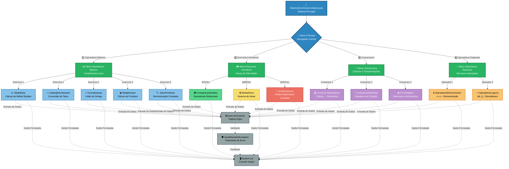

# 🧮 ExercisesOperators – Sistema Interativo de Prática em Java

## Slogan Filosófico
"Dominando a Lógica Essencial: Sua Plataforma Interativa para Operadores e Estruturas Fundamentais em Java."

---

## Abstract

O projeto `ExercisesOperators` apresenta uma plataforma interativa, desenvolvida em Java, que visa solidificar a compreensão e a aplicação prática de conceitos fundamentais da lógica de programação e da linguagem Java. Em um contexto onde a base é crucial para o desenvolvimento de sistemas mais complexos, este projeto aborda a lacuna de ambientes de aprendizado prático e centralizado para operadores aritméticos, relacionais, lógicos, casting de variáveis, concatenação e estruturas condicionais. A solução proposta é um sistema console-based, organizado de forma modular, que permite ao usuário navegar por diferentes categorias de exercícios, cada uma focada em um aspecto específico. A metodologia empregada prioriza a interatividade e a clareza, utilizando a classe `Scanner` para entrada de dados e `System.out` para feedback imediato. Os resultados esperados incluem uma melhor absorção dos conceitos por meio da prática direta e repetitiva. A contribuição principal deste projeto reside na sua capacidade de oferecer um ambiente de aprendizado estruturado e acessível, ideal para iniciantes em Java que buscam uma fundação sólida em seus estudos.

---

## Badges Abrangentes

[](https://github.com/ESousa97/ExercisesOperators/issues)
[](https://github.com/ESousa97/ExercisesOperators/pulls)
[](https://github.com/ESousa97/ExercisesOperators/commits/main)
[](https://github.com/ESousa97/ExercisesOperators/)
[](https://github.com/ESousa97/ExercisesOperators/)

---

## Sumário
- [Abstract](#abstract)
- [Badges Abrangentes](#badges-abrangentes)
- [Sumário](#sumário)
- [Introdução e Motivação](#introdução-e-motivação)
- [Arquitetura do Sistema](#arquitetura-do-sistema)
- [Decisões de Design Chave](#decisões-de-design-chave)
- [✨ Funcionalidades Detalhadas](#-funcionalidades-detalhadas)
  - [1. Operadores Básicos e Variáveis](#1-operadores-básicos-e-variáveis)
  - [2. Exercícios Interativos](#2-exercícios-interativos)
  - [3. Conversores e Cálculos](#3-conversores-e-cálculos)
  - [4. Operadores Especiais](#4-operadores-especiais)
- [📂 Estrutura Detalhada do Código-Fonte](#-estrutura-detalhada-do-código-fonte)
- [📋 Pré-requisitos Avançados](#-pré-requisitos-avançados)
- [🚀 Guia de Instalação e Configuração Avançada](#-guia-de-instalação-e-configuração-avançada)
- [⚙️ Uso Avançado e Exemplos](#️-uso-avançado-e-exemplos)
- [🔧 API Reference](#-api-reference)
- [🧪 Estratégia de Testes e Qualidade de Código](#-estratégia-de-testes-e-qualidade-de-código)
- [🚢 Deployment Detalhado e Escalabilidade](#-deployment-detalhado-e-escalabilidade)
- [📜 Licença e Aspectos Legais](#-licença-e-aspectos-legais)
- [👥 Desenvolvedor](#-Desenvolvedor)
- [❓ FAQ (Perguntas Frequentes)](#-faq-perguntas-frequentes)
- [📞 Contato e Suporte](#-contato-e-suporte)

---

## Introdução e Motivação

No universo do desenvolvimento de software, a compreensão profunda dos fundamentos de uma linguagem de programação é a pedra angular para a construção de sistemas robustos e eficientes. Em Java, os operadores e as estruturas condicionais não são exceção; eles formam a espinha dorsal de qualquer lógica de negócio. No entanto, muitos iniciantes enfrentam desafios na transição do conhecimento teórico para a aplicação prática desses conceitos. A escassez de ambientes de aprendizado interativos e focados, que permitam a experimentação direta e o feedback imediato, muitas vezes dificulta essa curva de aprendizado.

O projeto `ExercisesOperators` surge como uma resposta direta a essa necessidade. Sua motivação central é fornecer uma plataforma acessível e didática que preencha essa lacuna. Ao invés de apenas apresentar exercícios estáticos, o projeto oferece um sistema interativo baseado em console, onde os usuários podem executar e testar conceitos como operadores aritméticos (`+`, `-`, `*`, `/`, `%`), operadores relacionais (`==`, `!=`, `>`, `<`, `>=`, `<=`), operadores lógicos (`&&`, `||`, `!`), casting de variáveis, concatenação de strings e a aplicação de estruturas condicionais (`if`, `else if`, `else`).

A proposta de valor única do `ExercisesOperators` reside na sua organização modular e na experiência de usuário simplificada, mas eficaz. Cada exercício é encapsulado em sua própria classe, promovendo a clareza e a reusabilidade, enquanto um sistema de menu centralizado (`SistemaExerciciosCompleto.java`) orquestra a interação, guiando o usuário através de diferentes níveis de dificuldade e categorias temáticas. Este design não apenas facilita o aprendizado progressivo, mas também serve como um exemplo prático de modularização em Java. O objetivo de longo prazo é capacitar novos desenvolvedores com uma base sólida, permitindo-lhes construir com confiança sobre esses fundamentos para enfrentar desafios de programação mais complexos.

---

## Visão Demo

<div align="center">


</div>

## Arquitetura do Sistema

O `ExercisesOperators` adota uma arquitetura monolítica simplificada, ideal para fins educacionais e de demonstração. O sistema é fundamentalmente baseado em console, com foco na lógica de negócio e na interação direta via entrada/saída padrão.



**Componentes Principais:**

*   **`SistemaExerciciosCompleto.java` (Controlador Principal):** Atua como o ponto de entrada da aplicação e o orquestrador central. Ele gerencia o fluxo de navegação através dos menus, lê a entrada do usuário e invoca os métodos estáticos correspondentes nas classes de exercícios individuais. É responsável pela experiência do usuário, exibindo menus e mensagens de boas-vindas/despedida.
*   **Classes de Exercícios Individuais (Ex: `AnaliseNumero.java`, `MediaAluno.java`, etc.):** Cada uma dessas classes encapsula a lógica de um exercício específico. Elas contêm o método `main` que é invocado pelo `SistemaExerciciosCompleto` para executar o exercício. São módulos independentes que realizam a entrada de dados (via `Scanner`), processam a lógica do exercício e imprimem os resultados (via `System.out`).
*   **`java.util.Scanner` (Entrada de Dados):** Utilizado por quase todas as classes de exercícios para ler a entrada do usuário a partir do console.
*   **`System.out` (Saída de Dados):** Utilizado por todas as classes para exibir prompts, resultados e mensagens informativas no console.

**Interações e Fluxo de Dados:**

1.  O `SistemaExerciciosCompleto` inicia, exibe o menu principal e aguarda a entrada do usuário.
2.  Com base na opção selecionada, ele chama um método de menu secundário (ex: `menuOperadoresBasicos()`).
3.  Dentro do menu secundário, o usuário escolhe um exercício específico.
4.  O método do menu secundário invoca o método `main` estático da classe de exercício correspondente (ex: `ComparacaoSimples.main(null)`).
5.  A classe de exercício executa sua lógica, interagindo com o usuário via `Scanner` e `System.out`.
6.  Após a conclusão do exercício, o controle retorna ao menu secundário, e, eventualmente, ao menu principal.

**Decisões Arquiteturais Chave e Justificativas:**

*   **Monolítico e Console-Based:** A escolha de uma arquitetura monolítica e a interação via console foi deliberada para manter a simplicidade e o foco no aprendizado da lógica de programação e dos operadores Java. Evita a complexidade de frameworks de UI ou de comunicação entre serviços, permitindo que os alunos se concentrem nos fundamentos.
*   **Modularização por Classes:** Cada exercício reside em sua própria classe `.java`. Isso promove a modularidade, a clareza do código e a facilidade de manutenção. Cada arquivo é autocontido em sua funcionalidade, tornando-o fácil de entender e, potencialmente, de reutilizar.
*   **Centralização com `SistemaExerciciosCompleto`:** A classe `SistemaExerciciosCompleto` atua como um hub, proporcionando uma experiência de usuário unificada e guiada. Isso evita que o usuário precise compilar e executar cada arquivo individualmente, o que seria menos prático para um sistema de exercícios.

---

## Decisões de Design Chave

As decisões de design deste projeto foram tomadas com o objetivo principal de maximizar a clareza didática, a simplicidade de uso e a eficácia no aprendizado dos fundamentos de Java.

*   **Linguagem de Programação: Java 11+**
    *   **Porquê:** Java é uma linguagem robusta, amplamente utilizada no mercado e com uma curva de aprendizado bem documentada para iniciantes. A versão 11+ garante acesso a recursos mais modernos e é uma versão de suporte de longo prazo (LTS), proporcionando estabilidade.
    *   **Alternativas Consideradas:** Python (mais simples para iniciantes, mas o foco era Java), C++ (maior complexidade de gerenciamento de memória). Java foi escolhido por seu equilíbrio entre poder e acessibilidade para o público-alvo.
*   **Ambiente de Interação: Console (via `java.util.Scanner` e `System.out`)**
    *   **Porquê:** A interação via console é a forma mais direta e descomplicada de entrada/saída em Java para programas simples. Isso permite que os alunos se concentrem inteiramente na lógica do programa e no uso de operadores, sem a distração de interfaces gráficas ou frameworks de UI complexos. O `Scanner` é a ferramenta padrão e didaticamente simples para ler entradas.
    *   **Alternativas Consideradas:** Frameworks GUI como Swing/JavaFX (adicionariam complexidade desnecessária para o objetivo de aprendizado de operadores), bibliotecas de terceiros para console (desnecessárias, `Scanner` é suficiente).
*   **Estrutura de Código: Classes Autônomas para Exercícios**
    *   **Porquê:** Cada exercício é encapsulado em sua própria classe (`.java`), com um método `main` próprio. Essa abordagem modular facilita a compreensão de cada problema isoladamente e permite que cada exercício seja executado de forma independente, se desejado. Isso também reforça o conceito de classes e métodos em Java desde o início.
    *   **Alternativas Consideradas:** Um único arquivo `Main.java` com todos os exercícios (tornaria o arquivo excessivamente longo e difícil de navegar), múltiplos métodos dentro de uma única classe (menos organizado e menos claro para o propósito de exercícios distintos).
*   **Orquestração Centralizada: `SistemaExerciciosCompleto.java`**
    *   **Porquê:** Embora os exercícios sejam autônomos, a introdução de `SistemaExerciciosCompleto.java` oferece uma experiência de usuário unificada e guiada. Ele atua como um menu principal, permitindo que o usuário selecione e execute diferentes exercícios sem a necessidade de recompilar ou executar comandos Java manualmente para cada um. Isso simula um pequeno "aplicativo" e demonstra um conceito básico de arquitetura de menu.
    *   **Benefícios:** Melhora a usabilidade, facilita a descoberta de exercícios, e demonstra uma aplicação prática de estruturas condicionais (`switch`) e loops (`while`) para controle de fluxo.

---

## ✨ Funcionalidades Detalhadas

O sistema `ExercisesOperators` é estruturado em um menu principal que se ramifica em categorias, cada uma contendo exercícios específicos para a prática de diferentes conceitos em Java.

### 1. Operadores Básicos e Variáveis
Esta categoria foca na manipulação de variáveis, tipos de dados e operadores aritméticos fundamentais.

*   **Média de Duas Notas (`MediaNota.java`)**
    *   **Propósito:** Demonstrar o uso de variáveis `double` e o operador de divisão (`/`) para calcular uma média.
    *   **Caso de Uso:** Um estudante deseja calcular a média de suas duas notas em uma disciplina. O sistema exibe o cálculo `(nota1 + nota2) / 2`.
*   **Casting de Variáveis (`CastingDasVariaveis.java`)**
    *   **Propósito:** Ilustrar a conversão explícita (casting) entre tipos de dados, especificamente de `double` para `int`, e as implicações dessa conversão (perda de precisão).
    *   **Caso de Uso:** Um programador precisa converter um valor monetário (`double`) para um número inteiro (`int`) para um cálculo específico que não requer casas decimais. O sistema mostra como `8.2` se torna `8` ao ser convertido para `int`.
*   **Concatenação de Caracteres (`Concatenacao.java`)**
    *   **Propósito:** Ensinar a combinação de diferentes tipos de dados (`char`, `String`) em uma única string de saída usando o operador `+`.
    *   **Caso de Uso:** Um aplicativo precisa criar uma mensagem personalizada que inclua uma letra e um texto. O sistema demonstra como "Isso é uma concatenação da letra: 'a' com o Texto de uma String" é formado.
*   **Multiplicação de Produtos (`Multiplicacao.java`)**
    *   **Propósito:** Praticar o uso de variáveis `double` e `int` em conjunto com o operador de multiplicação (`*`) para cálculos comerciais.
    *   **Caso de Uso:** Um vendedor calcula o preço total de 7 unidades de um produto que custa R$ 9.50 cada. O sistema retorna o preço final de R$ 66.50.
*   **Tipos Primitivos - Exercício Completo (`OperadoresPrimitivos.java`)**
    *   **Propósito:** Reforçar a declaração e atribuição de valores a diferentes tipos de dados primitivos em Java (boolean, int, char, byte, long, float, double).
    *   **Caso de Uso:** Um desenvolvedor está revisando os tipos de dados básicos em Java e quer ver exemplos de declaração e uso de cada um. O exercício mostra variáveis como `idade = 25`, `preco = 19.99f`, `salario = 5500.75`.

### 2. Exercícios Interativos
Esta seção oferece desafios de dificuldade crescente, utilizando operadores relacionais e estruturas condicionais.

*   **[FÁCIL] Comparação Simples (`ComparacaoSimples.java`)**
    *   **Propósito:** Introduzir os operadores de igualdade (`==`) e diferença (`!=`) com entrada de usuário.
    *   **Caso de Uso:** Dois números são inseridos (ex: 5 e 5). O sistema informa "O número 5 é igual ao número 5". Se forem 5 e 7, informa "O número 5 é diferente do número 7".
*   **[MÉDIO] Média do Aluno (`MediaAluno.java`)**
    *   **Propósito:** Aplicar cálculos de média e estruturas condicionais (`if`, `else if`, `else`) para determinar o status de aprovação.
    *   **Caso de Uso:** Um professor insere três notas de um aluno (ex: 6.0, 7.0, 8.0). O sistema calcula a média (7.0) e informa "Aprovado". Se a média for 5.5, informa "Recuperação". Se for 4.0, informa "Reprovado".
*   **[DIFÍCIL] Análise Completa de Número (`AnaliseNumero.java`)**
    *   **Propósito:** Combinar operadores aritméticos (`%`), lógicos (`&&`, `||`) e relacionais (`>`) com múltiplas estruturas condicionais para analisar propriedades de um número.
    *   **Caso de Uso:** O usuário insere um número (ex: 30). O sistema verifica e informa: "O número 30 é PAR.", "30 é múltiplo de 5 e de 3", "30 não é maior que 100."

### 3. Conversores e Cálculos
Esta categoria explora a aplicação de fórmulas e cálculos mais complexos.

*   **Conversor de Temperatura (Celsius -> Fahrenheit) (`ConversorTemperatura.java`)**
    *   **Propósito:** Praticar cálculos com números decimais e formatação de saída, incluindo casting para `int`.
    *   **Caso de Uso:** Um usuário deseja converter 39.7 Celsius para Fahrenheit. O sistema calcula e exibe "A temperatura de 39.700000 Celsius é exatamente: 103.460000 Fahrenheit" e "A temperatura em Fahrenheit inteira é: 103".
*   **Conversor Dólar -> Real (`ConversorDolarReal.java`)**
    *   **Propósito:** Realizar conversões monetárias, utilizando valores decimais e formatação de saída.
    *   **Caso de Uso:** Um viajante tem 224.50 dólares e quer saber quanto isso vale em reais, com a cotação de 4.94. O sistema calcula e exibe "USD 224.50 convertidos fica: R$ 1109.03".
*   **Calculadora de Desconto/Porcentagem (`Porcentagem.java`)**
    *   **Propósito:** Calcular descontos percentuais e o preço final de um produto.
    *   **Caso de Uso:** Uma loja oferece 10% de desconto em um produto de R$ 5812.97. O sistema detalha: "Preço original: R$ 5812.97", "Desconto de 10.0%: R$ 581.297", "Preço final com desconto: R$ 5231.673".

### 4. Operadores Especiais
Esta seção aborda operadores de incremento/decremento e operadores lógicos.

*   **Operadores de Incremento (`OperadoresDeIncremento.java`)**
    *   **Propósito:** Demonstrar a diferença entre os operadores de pré-incremento (`++variavel`) e pós-incremento (`variavel++`).
    *   **Caso de Uso:** Um desenvolvedor quer entender como `contador++` e `++contador` afetam o valor da variável e o valor retornado na expressão. O sistema mostra que `int resultado = contador++;` primeiro atribui `0` a `resultado` e depois incrementa `contador`, enquanto `int resultado = ++contador;` primeiro incrementa `contador` e depois atribui `1` a `resultado`.
*   **Operadores Lógicos (`OperadoresLogicos.java`)**
    *   **Propósito:** Ilustrar o uso dos operadores lógicos AND (`&&`), OR (`||`) e NOT (`!`) para combinar e negar condições booleanas.
    *   **Caso de Uso:** Um sistema decide se um usuário pode sair com base em ter dinheiro (true), fazer sol (false) e carro disponível (true). O sistema avalia e exibe: "Pode sair: false", "Ir para o shooping: true", "Ficar em casa: false".

---

## 📋 Pré-requisitos Avançados

Para compilar e executar o projeto `ExercisesOperators`, você precisará dos seguintes softwares e ferramentas instaladas em seu ambiente:

*   **Java Development Kit (JDK):**
    *   **Versão Mínima:** JDK 11
    *   **Versão Recomendada/Testada:** JDK 17 (ou a versão LTS mais recente disponível)
    *   **Justificativa:** O projeto utiliza recursos padrão do Java que são compatíveis com a versão 11 e superiores. Recomenda-se uma versão LTS para maior estabilidade e suporte a longo prazo.
    *   **Verificação:** Para verificar sua versão do JDK, abra um terminal ou prompt de comando e execute:
        ```bash
        java -version
        javac -version
        ```
        Certifique-se de que ambas as saídas indiquem uma versão 11 ou superior.
*   **Ambiente de Desenvolvimento Integrado (IDE):**
    *   **Recomendado:** IntelliJ IDEA (Community Edition ou Ultimate)
    *   **Alternativas:** Eclipse IDE for Java Developers, Visual Studio Code com a extensão "Extension Pack for Java".
    *   **Justificativa:** Uma IDE moderna facilita a compilação, execução, depuração e gerenciamento do projeto Java. O arquivo `ExercisesOperators.iml` é específico do IntelliJ IDEA.
*   **Sistema de Controle de Versão:**
    *   **Ferramenta:** Git
    *   **Justificativa:** Necessário para clonar o repositório do GitHub.
    *   **Verificação:**
        ```bash
        git --version
        ```
*   **Terminal/Prompt de Comando:**
    *   **Justificativa:** Para executar comandos de compilação e execução manual (opcional, se não usar a IDE).

---

## 🚀 Guia de Instalação e Configuração Avançada

Siga os passos abaixo para configurar e executar o projeto `ExercisesOperators` em seu ambiente de desenvolvimento.

### 1. Clonar o Repositório

Abra seu terminal ou prompt de comando e execute o seguinte comando para clonar o repositório para sua máquina local:

```bash
git clone https://github.com/ESousa97/ExercisesOperators.git
```

Navegue até o diretório do projeto:

```bash
cd ExercisesOperators
```

### 2. Configuração na IDE (Recomendado: IntelliJ IDEA)

1.  **Abrir o Projeto:**
    *   Abra o IntelliJ IDEA.
    *   Selecione `File` > `Open...` (ou `Abrir...`).
    *   Navegue até o diretório `ExercisesOperators` que você clonou e selecione-o. Clique em `OK` (ou `Abrir`).
2.  **Configurar o SDK do Java:**
    *   O IntelliJ geralmente detecta automaticamente o JDK instalado. Se não o fizer, ou se você tiver múltiplos JDKs, vá em `File` > `Project Structure...` (ou `Estrutura do Projeto...`).
    *   Em `Project SDK` (ou `SDK do Projeto`), selecione o JDK 11 ou superior que você instalou.
    *   Em `Project language level` (ou `Nível de linguagem do projeto`), certifique-se de que esteja configurado para a versão do JDK selecionada (ex: `11 - LTS` ou `17 - LTS`).
    *   Clique em `OK` para aplicar as configurações.
3.  **Compilar e Executar:**
    *   O IntelliJ compilará o projeto automaticamente.
    *   Para executar o sistema principal, localize o arquivo `src/main/SistemaExerciciosCompleto.java` no painel do projeto.
    *   Clique com o botão direito do mouse sobre ele e selecione `Run 'SistemaExerciciosCompleto.main()'`. Alternativamente, clique no ícone de "play" (triângulo verde) ao lado da declaração da classe `SistemaExerciciosCompleto` ou do método `main`.

### 3. Compilação e Execução Manual (Via Terminal)

Se você preferir compilar e executar o projeto diretamente via linha de comando, siga estes passos:

1.  **Navegue até a Raiz do Projeto:**
    ```bash
    cd ExercisesOperators
    ```
2.  **Compilar os Arquivos Java:**
    Como os arquivos estão em diretórios diferentes (`src/` e `src/main/`), você precisará compilar ambos. Certifique-se de que seu `PATH` esteja configurado para o JDK.
    ```bash
    javac src/*.java src/main/*.java
    ```
    *   Este comando compilará todos os arquivos `.java` presentes no diretório `src` e no subdiretório `src/main`, gerando os arquivos `.class` correspondentes.
3.  **Executar o Sistema Principal:**
    Para iniciar o sistema interativo de exercícios, execute a classe principal `SistemaExerciciosCompleto`, que está no pacote `main`.
    ```bash
    java -cp . src.main.SistemaExerciciosCompleto
    ```
    *   O `-cp .` (classpath .) é importante para que o Java encontre as classes compiladas no diretório atual.
    *   Você também pode executar exercícios individuais diretamente, por exemplo:
        ```bash
        java -cp . src.ComparacaoSimples
        ```

---

## ⚙️ Uso Avançado e Exemplos

O `ExercisesOperators` foi projetado para ser intuitivo, mas entender o fluxo principal do `SistemaExerciciosCompleto` otimiza a experiência de aprendizado.

### Navegando pelo Sistema Interativo

Após iniciar o `SistemaExerciciosCompleto.java`, você será recebido por uma mensagem de boas-vindas e o **Menu Principal**:

```
============================================================
SISTEMA COMPLETO DE EXERCICIOS JAVA
Operadores, Conversores e Logica de Programacao
============================================================
Bem-vindo ao sistema mais completo para praticar Java!
Aqui voce encontrara todos os exercicios organizados por categoria. Clique ENNTER para continuar...
```

Pressione `ENTER` para prosseguir. O **Menu Principal** será exibido, oferecendo as categorias de exercícios:

```
==================================================
MENU PRINCIPAL
==================================================
1. Operadores Basicos e Variaveis
2. Exercicios Interativos (Facil/Medio/Dificil)
3. Conversores e Calculos
4. Operadores Especiais
0. Sair do Sistema
==================================================
Digite sua opcao:
```

**Exemplo de Fluxo de Uso:**

Vamos simular a execução do exercício "Análise Completa de Número" (Difícil):

1.  **No Menu Principal:** Digite `2` (para "Exercícios Interativos") e pressione `ENTER`.
2.  Você será levado ao **Menu Exercícios Interativos**:
    ```
    ==================================================
    EXERCICIOS INTERATIVOS
    ==================================================
    1. [FACIL] Comparacao Simples
    2. [MEDIO] Media do Aluno
    3. [DIFICIL] Analise Completa de Numero
    0. Voltar ao Menu Principal
    ==================================================
    Digite sua opcao:
    ```
3.  **No Menu Exercícios Interativos:** Digite `3` (para "Análise Completa de Número") e pressione `ENTER`.
4.  O exercício `AnaliseNumero.java` será executado:
    ```
    Digite um número inteiro: 30
    O número 30 é PAR.
    30 é múltiplo de 5 e de 3
    30 não é maior que 100.
    Pressione ENTER para continuar...
    ```
5.  Pressione `ENTER` para retornar ao **Menu Exercícios Interativos**. Você pode escolher outro exercício ou digitar `0` para voltar ao **Menu Principal**.
6.  Para sair completamente do sistema, digite `0` no **Menu Principal**.

### Execução de Exercícios Individuais

Embora o `SistemaExerciciosCompleto` seja o ponto de entrada recomendado, cada arquivo `.java` de exercício é um programa Java válido por si só e pode ser compilado e executado individualmente (via IDE ou terminal), desde que possuam um método `main`.

**Exemplo (via terminal, após compilação):**

```bash
java -cp . src.CastingDasVariaveis
```

Isso executaria apenas o exercício de Casting, sem o contexto do menu interativo.

---

## 🔧 API Reference

Este projeto é uma aplicação console-based e não expõe uma API RESTful ou qualquer outra interface de programação de aplicação para consumo externo. Sua interação é puramente via entrada e saída padrão (console).

Portanto, esta seção **não é aplicável** a este projeto neste momento.

---

## 🧪 Estratégia de Testes e Qualidade de Código

Dado o propósito educacional e a natureza do projeto `ExercisesOperators` (foco em fundamentos de Java via console), a estratégia de testes é primariamente baseada em **testes manuais e validação interativa**.

*   **Tipos de Testes Implementados:**
    *   **Testes Manuais/Interativos:** Cada exercício é projetado para ser executado e testado manualmente através da interação com o console. Os usuários inserem dados e verificam a saída esperada, confirmando o comportamento correto dos operadores e estruturas condicionais.
    *   **Testes de Unidade Implícitos:** Embora não haja uma suíte de testes automatizada formal (como JUnit), a modularização de cada exercício em uma classe separada permite que cada "unidade" de funcionalidade seja testada isoladamente através de sua execução direta.

*   **Ferramentas e Frameworks de Teste:**
    *   Não são utilizadas ferramentas ou frameworks de teste automatizados (como JUnit, Mockito) neste projeto. A complexidade de configurar e manter uma suíte de testes seria contraproducente para o objetivo didático de focar nos fundamentos da linguagem.

*   **Como Executar a Suíte de Testes (Manual):**
    Para "testar" o projeto, basta executar o `SistemaExerciciosCompleto.java` e navegar por todas as opções de menu, inserindo diferentes entradas para cada exercício e validando a correção das saídas. Recomenda-se testar casos de borda (ex: números zero, negativos, limites de aprovação/reprovação) para cada exercício interativo.

*   **Qualidade de Código:**
    A qualidade do código é mantida através da aderência a boas práticas de programação Java, como:
    *   **Clareza e Legibilidade:** Variáveis com nomes descritivos, comentários explicativos quando necessário.
    *   **Modularização:** Separação de responsabilidades em classes distintas para cada exercício.
    *   **Consistência:** Padrões de formatação e estilo consistentes em todo o código.
    *   **Não são utilizadas ferramentas de análise estática de código (linters/formatadores) como SonarQube ou Checkstyle neste projeto**, mas a estrutura e o estilo visam a simplicidade e a compreensão.

*   **Integração Contínua/Entrega Contínua (CI/CD):**
    Não há pipelines de CI/CD configuradas para este projeto, pois é um projeto educacional local e não um sistema em produção que requer automação de build, teste e deploy contínuos.

---

## 🚢 Deployment Detalhado e Escalabilidade

Este projeto, `ExercisesOperators`, é uma aplicação console-based desenvolvida com o propósito principal de aprendizado e prática dos fundamentos da linguagem Java. Como tal, ele foi concebido para ser executado em um ambiente de desenvolvimento local e **não possui requisitos de deployment ou considerações de escalabilidade** típicas de aplicações de produção (web services, aplicações distribuídas, etc.).

*   **Modelo de Execução:** O projeto é executado diretamente a partir do Java Virtual Machine (JVM) em qualquer sistema operacional que suporte o JDK 11+.
*   **Plataformas de Deployment:** Não há plataformas de deployment específicas (como AWS, Azure, Google Cloud, Kubernetes, Docker) envolvidas ou necessárias para este projeto. A execução se dá no ambiente local do usuário.
*   **Escalabilidade:** Conceitos como escalabilidade horizontal (adicionar mais instâncias), balanceamento de carga, monitoramento de performance, logging centralizado ou sistemas de alerting **não são aplicáveis** a este projeto. Sua natureza monolítica e de execução local não demanda tais considerações.

Em resumo, o `ExercisesOperators` é um projeto "standalone" que não requer infraestrutura de servidor ou de nuvem para operar. Seu "deploy" consiste simplesmente em clonar o repositório e executá-lo localmente.

---

📜 Licença
Este projeto está licenciado sob a Licença MIT - uma das licenças de código aberto mais permissivas e amplamente utilizadas.
O que isso significa:

✅ Uso livre: Pode usar o código para qualquer propósito
✅ Modificação: Pode alterar e adaptar o código conforme necessário
✅ Distribuição: Pode compartilhar o código original ou modificado
✅ Uso comercial: Pode usar em projetos comerciais
✅ Uso privado: Pode usar em projetos pessoais ou internos

Única condição:

📋 Atribuição: Deve manter o aviso de copyright e a licença nos arquivos

Para desenvolvedores:
Esta licença facilita a colaboração e o reuso por parte da comunidade, sendo ideal para projetos educacionais e de aprendizado como este repositório de exercícios Java.
Veja o arquivo [LICENSE](/LICENSE) para o texto completo da licença.

---

## 👥 Desenvolvedor

O projeto `ExercisesOperators` foi concebido e desenvolvido por:

*   **José Enoque**
    *   Entusiasta de desenvolvimento Java e automação.
    *   [LinkedIn](https://www.linkedin.com/in/enoque-sousa-bb89aa168/)
    *   [GitHub](https://github.com/ESousa97)

Agradecemos a todos os potenciais futuros colaboradores que se juntarem a nós para aprimorar e expandir este recurso de aprendizado.

---

## ❓ FAQ (Perguntas Frequentes)

Aqui estão algumas perguntas frequentes sobre o projeto `ExercisesOperators`:

**1. Qual versão do Java preciso para rodar este projeto?**
    Você precisa do Java Development Kit (JDK) versão 11 ou superior. Recomendamos usar uma versão LTS (Long Term Support) como JDK 17 para maior estabilidade.

**2. Posso usar qualquer IDE?**
    Sim, embora o IntelliJ IDEA seja o recomendado (e o projeto inclua arquivos `.iml` específicos para ele), você pode usar qualquer IDE que suporte desenvolvimento Java, como Eclipse ou Visual Studio Code (com as extensões Java apropriadas).

**3. Como faço para executar um exercício individualmente, sem o menu principal?**
    Cada arquivo `.java` na pasta `src/` (e `src/main/`) que contém um método `main` pode ser executado individualmente.
    Via terminal, após compilar (ex: `javac src/*.java src/main/*.java`), você pode executar:
    `java -cp . src.NomeDoArquivoDoExercicio` (ex: `java -cp . src.ComparacaoSimples`).

**4. O projeto tem testes automatizados?**
    Não, este projeto não inclui uma suíte de testes automatizada (como JUnit). Ele é focado no aprendizado interativo e na validação manual através da execução dos exercícios no console.

**5. Encontrei um bug ou tenho uma sugestão de nova funcionalidade. Onde posso reportar?**
    Por favor, abra uma [Issue no GitHub](https://github.com/ESousa97/ExercisesOperators/issues) para relatar bugs ou sugerir funcionalidades. Descreva o problema ou a ideia com o máximo de detalhes possível.

**6. O projeto possui alguma interface gráfica?**
    Não, o projeto é totalmente baseado em console. A interação ocorre através de entrada de texto e saída de texto no terminal. Isso foi uma decisão de design para focar nos fundamentos da lógica de programação sem a complexidade de uma interface gráfica.

**7. Este projeto é adequado para iniciantes em Java?**
    Sim, este projeto foi projetado especificamente para iniciantes em Java que desejam praticar e solidificar sua compreensão de operadores, tipos de dados e estruturas condicionais básicas. O sistema de menu interativo facilita a navegação e o aprendizado.

---

## 📞 Contato e Suporte

Para dúvidas, suporte ou discussões sobre o projeto `ExercisesOperators`, utilize os seguintes canais:

*   **Relatar Problemas / Abrir Sugestões (Issues):**
    A forma preferencial para relatar bugs, propor novas funcionalidades ou discutir ideias relacionadas diretamente ao código do projeto é através das [Issues do GitHub](https://github.com/ESousa97/ExercisesOperators/issues). Por favor, forneça o máximo de detalhes possível ao abrir uma nova issue.

*   **Contato com o Autor (José Enoque):**
    Para questões mais pessoais, profissionais ou para discussões que não se encaixam nas Issues do GitHub, você pode entrar em contato com o autor principal:
    *   **LinkedIn:** [José Enoque](https://www.linkedin.com/in/enoque-sousa-bb89aa168/)
    *   **GitHub:** [ESousa97](https://github.com/ESousa97)


> ✨ **Criado em:** 29 de abr. de 2025 às 22:19
