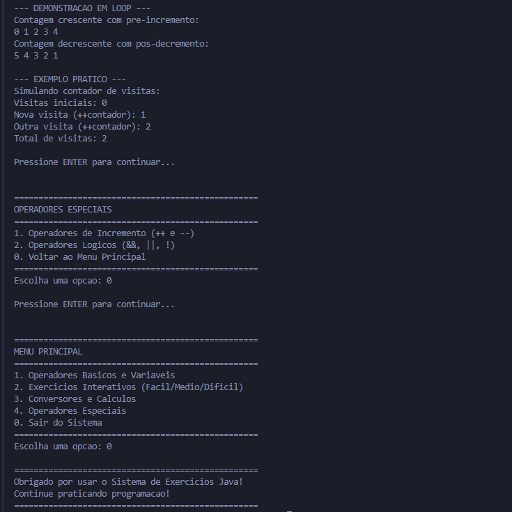
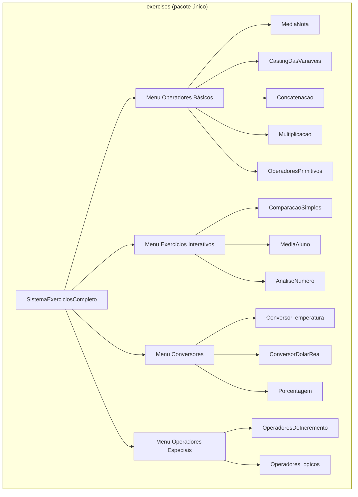

<div align="center">

# ExercisesOperators

[](https://github.com/ESousa97/ExercisesOperators/actions/workflows/ci.yml)
[](https://www.codefactor.io/repository/github/esousa97/exercisesoperators)
[](https://opensource.org/licenses/MIT)
[](#)

**Plataforma interativa de console em Java para prática de operadores e lógica de programação — 13 exercícios organizados em 4 categorias com níveis de dificuldade (Básico → Intermediário → Difícil), sistema de menus com switch expressions, exercícios standalone executáveis individualmente, Scanner global com validação robusta (InputMismatchException), testes com captura de stdout/stdin via JUnit 5, cobertura com JaCoCo, análise estática com Checkstyle + SpotBugs + CodeQL, e spell checking com CSpell.**

</div>

---

> **⚠️ Projeto Arquivado**
> Este projeto não recebe mais atualizações ou correções. O código permanece disponível como referência e pode ser utilizado livremente sob a licença MIT. Fique à vontade para fazer fork caso deseje continuar o desenvolvimento.

---

<div align="center">



</div>

---

## Índice

- [Sobre o Projeto](#sobre-o-projeto)
- [Funcionalidades](#funcionalidades)
- [Tecnologias](#tecnologias)
- [Arquitetura](#arquitetura)
- [Estrutura do Projeto](#estrutura-do-projeto)
- [Começando](#começando)
  - [Pré-requisitos](#pré-requisitos)
  - [Instalação](#instalação)
  - [Uso](#uso)
- [Scripts Disponíveis](#scripts-disponíveis)
- [Testes](#testes)
- [Qualidade e Governança](#qualidade-e-governança)
- [FAQ](#faq)
- [Licença](#licença)
- [Contato](#contato)

---

## Sobre o Projeto

Plataforma educacional de console para prática guiada de operadores e lógica de programação em Java. O sistema interativo (`SistemaExerciciosCompleto`) organiza 13 exercícios em 4 categorias com menus hierárquicos, enquanto cada exercício também possui `main()` próprio para execução standalone.

O repositório prioriza:

- **Sistema interativo com menus hierárquicos** — `SistemaExerciciosCompleto` como entry point com 4 submenus (Operadores Básicos, Exercícios Interativos, Conversores, Operadores Especiais), cada um com loop próprio e opção de voltar ao menu principal, usando switch expressions (Java 14+)
- **Scanner global com validação robusta** — Constante `SCANNER` compartilhada com métodos auxiliares (`lerOpcao`, `lerNumero`, `lerDouble`, `lerNota`, `lerBoolean`, `perguntarContinuar`) que tratam `InputMismatchException` e validam ranges, evitando crashes por entrada inválida
- **13 exercícios standalone** — Cada classe em `exercises/` tem `main()` próprio e pode ser executada independentemente via `-Dexec.mainClass`, cobrindo desde tipos primitivos até análise numérica avançada
- **Testes com captura de I/O** — `ExercisesTest` redireciona `System.out` para `ByteArrayOutputStream` e `System.in` para `ByteArrayInputStream`, validando saída formatada sem mocks externos
- **Pipeline de qualidade em 4 camadas** — CI com Build+Test+JaCoCo, Checkstyle (Google Style adaptado), SpotBugs (análise de bugs), CodeQL (segurança) e CSpell (spell checking de código e docs)

---

## Funcionalidades

### Operadores Básicos (Nível Básico)

- **Média de Duas Notas** — Cálculo com `double` e operador de divisão
- **Casting de Variáveis** — Conversão explícita `double` → `int` com demonstração de perda decimal e char ↔ ASCII
- **Concatenação** — Combinação de `char` e `String` com operador `+`
- **Multiplicação de Produtos** — Cálculo de total com desconto automático para compras ≥10 unidades
- **Tipos Primitivos** — Demonstração de `boolean`, `int`, `char`, `byte`, `long`, `float`, `double` com tabela de bytes e cálculo de IMC

### Exercícios Interativos (Fácil → Difícil)

- **Comparação Simples** — Operadores relacionais (`==`, `!=`, `>`, `<`) com análises extras (soma, produto, divisão) e loop de repetição
- **Média do Aluno** — Sistema de notas escolar com 3 bimestres, classificação (Aprovado ≥7 / Recuperação ≥5 / Reprovado <5), boletim formatado e estatísticas (maior/menor nota, variação)
- **Análise Completa de Número** — Paridade, múltiplos de 3/5/15, comparação com 100, sinal, quadrado/cubo/raiz quadrada

### Conversores e Cálculos (Intermediário)

- **Conversor de Temperatura** — Celsius ↔ Fahrenheit bidirecional com fórmula `F = C × 1.8 + 32`
- **Conversor Dólar ↔ Real** — Conversão bidirecional com cotação informada pelo usuário
- **Calculadora de Porcentagem** — 3 modos: desconto em produto, acréscimo/juros, porcentagem simples

### Operadores Especiais (Intermediário)

- **Incremento/Decremento** — Demonstração interativa de `++var` (pré) vs `var++` (pós) e `--var` vs `var--` com valor retornado
- **Operadores Lógicos** — Simulador de decisões (`&&`, `||`, `!`) com entrada do usuário + demonstração teórica com tabela-verdade completa

---

## Tecnologias


**Dependências:** JDK 17+ (switch expressions), JUnit Jupiter 5.10.2 (test), Checkstyle 10.14.0, SpotBugs 4.8.3, JaCoCo 0.8.11. Zero dependências de runtime.

---

## Arquitetura



### Categorias e Exercícios

| Categoria | Exercícios | Nível |
| --- | --- | --- |
| Operadores Básicos | MediaNota, CastingDasVariaveis, Concatenacao, Multiplicacao, OperadoresPrimitivos | Básico |
| Exercícios Interativos | ComparacaoSimples, MediaAluno, AnaliseNumero | Fácil → Difícil |
| Conversores e Cálculos | ConversorTemperatura, ConversorDolarReal, Porcentagem | Intermediário |
| Operadores Especiais | OperadoresDeIncremento, OperadoresLogicos | Intermediário |

### Padrão de Execução

O `SistemaExerciciosCompleto` (entry point do JAR) contém toda a lógica dos menus e exercícios interativos inline, com métodos auxiliares privados para cada exercício. Os 13 arquivos individuais são versões simplificadas com `main()` próprio para execução standalone e estudo isolado.

---

## Estrutura do Projeto

```
ExercisesOperators/
├── src/
│   ├── main/java/exercises/
│   │   ├── SistemaExerciciosCompleto.java      # Entry point — menus + todos os exercícios
│   │   ├── AnaliseNumero.java                  # Paridade, múltiplos, comparação (standalone)
│   │   ├── CastingDasVariaveis.java            # Conversão double → int (standalone)
│   │   ├── ComparacaoSimples.java              # Operadores relacionais (standalone)
│   │   ├── Concatenacao.java                   # char + String (standalone)
│   │   ├── ConversorDolarReal.java             # USD → BRL com cotação fixa (standalone)
│   │   ├── ConversorTemperatura.java           # Celsius → Fahrenheit (standalone)
│   │   ├── MediaAluno.java                     # 3 notas → Aprovado/Recuperação/Reprovado (standalone)
│   │   ├── MediaNota.java                      # Média de 2 notas (standalone)
│   │   ├── Multiplicacao.java                  # Preço × quantidade (standalone)
│   │   ├── OperadoresDeIncremento.java         # ++/-- pré e pós (standalone)
│   │   ├── OperadoresLogicos.java              # &&, ||, ! (standalone)
│   │   ├── OperadoresPrimitivos.java           # 8 tipos primitivos Java (standalone)
│   │   └── Porcentagem.java                    # Desconto percentual (standalone)
│   └── test/java/exercises/
│       └── ExercisesTest.java                  # 16 testes — captura stdout/stdin
├── assets/
│   └── ExercisesOperators.png                  # Screenshot do sistema
├── .github/
│   ├── workflows/
│   │   ├── ci.yml                              # Build + Test + JaCoCo + Checkstyle + SpotBugs + CSpell
│   │   └── codeql.yml                          # Análise de segurança CodeQL (semanal + push)
│   ├── ISSUE_TEMPLATE/
│   │   ├── bug_report.md
│   │   └── feature_request.md
│   ├── PULL_REQUEST_TEMPLATE.md
│   └── dependabot.yml                          # Maven + GitHub Actions (semanal, seg 09:00 BRT)
├── config/
│   └── checkstyle.xml                          # Google Style adaptado (30+ regras)
├── cspell.config.json                          # Dicionário pt-BR + en + termos do projeto
├── pom.xml                                     # JDK 17, JUnit 5.10.2, JaCoCo 0.8.11, Checkstyle 10.14.0, SpotBugs 4.8.3
├── .editorconfig                               # UTF-8, LF, indent 4 (Java/XML), indent 2 (YAML/JSON/MD)
├── .gitattributes                              # LF normalizado + linguist-language=Java
├── CHANGELOG.md                                # Keep a Changelog (v0.1.0 → v1.0.0)
├── CONTRIBUTING.md                             # Conventional Commits + guia de contribuição
├── CODE_OF_CONDUCT.md                          # Contributor Covenant 2.1
├── SECURITY.md                                 # Política de segurança
└── LICENSE                                     # MIT
```

---

## Começando

### Pré-requisitos

```bash
java -version   # JDK 17 ou superior
mvn -v          # Maven 3.9+
```

### Instalação

```bash
git clone https://github.com/ESousa97/ExercisesOperators.git
cd ExercisesOperators
mvn clean compile
```

### Uso

**Sistema interativo completo (menus):**

```bash
mvn -q exec:java -Dexec.mainClass="exercises.SistemaExerciciosCompleto"
```

**Via JAR:**

```bash
mvn clean package
java -jar target/exercises-operators-1.0.0.jar
```

**Exercício individual (standalone):**

```bash
mvn -q exec:java -Dexec.mainClass="exercises.MediaNota"
mvn -q exec:java -Dexec.mainClass="exercises.AnaliseNumero"
mvn -q exec:java -Dexec.mainClass="exercises.ConversorTemperatura"
```

---

## Scripts Disponíveis

```bash
# Compilar
mvn clean compile

# Executar testes unitários
mvn test

# Build completo + testes + cobertura
mvn verify

# Verificar estilo de código
mvn checkstyle:check

# Análise estática de bugs
mvn spotbugs:check

# Gerar JAR executável
mvn clean package

# Relatório de cobertura: target/site/jacoco/index.html
```

---

## Testes

```bash
mvn test

# Com cobertura
mvn verify
# Relatório: target/site/jacoco/index.html
```

**16 testes** em `ExercisesTest.java` usando captura de I/O:

- **Método `captureOutput(Runnable)`** — Redireciona `System.out` para `ByteArrayOutputStream` para validar saída de exercícios sem input
- **Método `captureOutputWithInput(String, Runnable)`** — Redireciona `System.out` e `System.in` para validar exercícios interativos (AnaliseNumero, ComparacaoSimples, MediaAluno)

Cobertura dos 13 exercícios standalone:

| Exercício | Testes | Validações |
| --- | --- | --- |
| MediaNota | 1 | Cálculo de média (9.1) |
| CastingDasVariaveis | 1 | Resultado do casting (8) |
| Concatenacao | 1 | Presença de `'a'` e "concatenação" |
| ConversorDolarReal | 1 | Presença de USD e R$ |
| ConversorTemperatura | 1 | Presença de °C e °F |
| Multiplicacao | 1 | Presença de R$ |
| OperadoresDeIncremento | 1 | Pré e pós-incremento |
| OperadoresLogicos | 1 | Resultados true/false |
| OperadoresPrimitivos | 1 | Tipos boolean, int, double |
| Porcentagem | 1 | Desconto e R$ |
| AnaliseNumero | 2 | Par/ímpar, múltiplos, comparação com 100 |
| ComparacaoSimples | 2 | Números iguais e diferentes |
| MediaAluno | 3 | Aprovado (≥7), reprovado (<5), recuperação (5-7) |

---

## Qualidade e Governança

- **CI** — GitHub Actions com 4 jobs paralelos:
  - **Build & Test** — Matrix JDK 17 + 21, `mvn verify`, upload de relatório JaCoCo como artifact (7 dias)
  - **Checkstyle** — Google Java Style adaptado com 30+ regras (nomenclatura, imports, whitespace, blocks, coding, design, Javadoc informacional)
  - **SpotBugs** — Análise estática de bugs em bytecode
  - **Spellcheck** — CSpell com dicionário pt-BR + en + termos customizados do projeto
- **CodeQL** — Análise de segurança em push, PR e schedule semanal (segunda 08:00 UTC)
- **Dependabot** — Atualizações semanais de Maven e GitHub Actions (segunda 09:00 BRT, labels por tipo)
- **Governança** — Issue templates (Bug Report, Feature Request), PR template com checklist de 7 items, CONTRIBUTING.md com Conventional Commits, CODE_OF_CONDUCT.md, SECURITY.md
- **Zero dependências de runtime** — Apenas JDK padrão; JUnit 5, Checkstyle, SpotBugs e JaCoCo são exclusivamente de build/test

---

## FAQ

<details>
<summary><strong>Qual a diferença entre o sistema interativo e os exercícios standalone?</strong></summary>

O `SistemaExerciciosCompleto` é o entry point do JAR e contém toda a lógica dos menus hierárquicos com versões enriquecidas dos exercícios (loops de repetição, análises extras, formatação avançada). Os 13 arquivos individuais são versões simplificadas com `main()` próprio, ideais para estudo isolado de um conceito específico sem navegar pelos menus.
</details>

<details>
<summary><strong>Como os testes funcionam se os exercícios usam System.in e System.out?</strong></summary>

`ExercisesTest` redireciona `System.out` para `ByteArrayOutputStream` e `System.in` para `ByteArrayInputStream` antes de executar cada exercício. Após a execução, a saída capturada é validada com `assertTrue(output.contains(...))`. O `System.out` e `System.in` originais são restaurados no bloco `finally`.
</details>

<details>
<summary><strong>Por que Checkstyle + SpotBugs + CodeQL?</strong></summary>

Cada ferramenta cobre uma dimensão diferente: Checkstyle verifica estilo e convenções (nomenclatura, formatação, imports), SpotBugs detecta bugs potenciais no bytecode (null dereference, resource leaks), e CodeQL analisa vulnerabilidades de segurança. Para um projeto educacional, essa combinação serve como referência de boas práticas.
</details>

<details>
<summary><strong>Posso usar JDK 21 ou superior?</strong></summary>

Sim. O `pom.xml` define source/target como 17 (mínimo para switch expressions), mas a CI testa em JDK 17 e 21. Qualquer JDK ≥17 é compatível.
</details>

---

## Licença

Este projeto está sob a licença MIT. Veja o arquivo [LICENSE](LICENSE) para mais detalhes.

```
MIT License - você pode usar, copiar, modificar e distribuir este código.
```

---

## Contato

**José Enoque Costa de Sousa**

[](https://www.linkedin.com/in/enoque-sousa-bb89aa168/)
[](https://github.com/ESousa97)
[](https://enoquesousa.vercel.app)

---

<div align="center">

**[⬆ Voltar ao topo](#exercisesoperators)**

Feito com ❤️ por [José Enoque](https://github.com/ESousa97)

**Status do Projeto:** Archived — Sem novas atualizações

</div>
